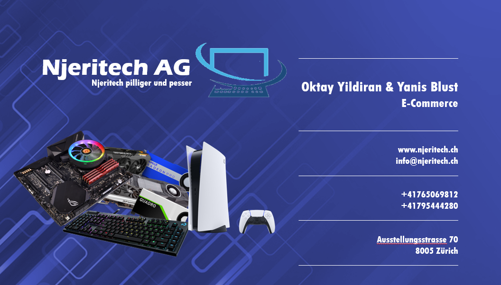

# Anforderungen

## Inhaltsverszeichnis
- [Anforderungen](#anforderungen)
  - [Inhaltsverszeichnis](#inhaltsverszeichnis)
    - [Vorstellung der Firma](#vorstellung-der-firma)
    - [Welche Art von Hosting macht in unserem Fall am meisten Sinn?](#welche-art-von-hosting-macht-in-unserem-fall-am-meisten-sinn)

### Vorstellung der Firma

Njeritech ist unsere Firma, welche in Zukunft im Bereich der Hardware sich fokussieren wird. Wir wollen uns im Bereich des Hardware Handel und Verkauf neu etablieren. Wir wollen stets unseren Kunden einen fairen Preis bieten.

### Welche Art von Hosting macht in unserem Fall am meisten Sinn?

In unserem Fall macht die Cloudlösung am meisten Sinn. Einer der wichtigsten Gründe ist die Skalierbarkeit von der Cloud. Damit ist gemeint, dass im Falle eines schnellen Wachstums, wir die benötigte Hardware kostengünstiger und schneller in Einsatz bringen können. Ein weiterer Grund ist, dass Arbeitskosten für das Betreiben der Hardware wegfallen und wir uns vollständig auf unsere Dienstleistungen fokussieren können. Auch fallen keine Anschaffungskosten für Hardware und Lizenzen an. Die Datensicherheit unserer Kunden ist uns wichtig und der Cloud Anbieter bietet uns eine Sicherheits Garantie. Die Verantwortung liegt bei uns wenn auf mit Software von unserer Seite Schwachstellen auftreten. 

Bei der On Premise Lösung muss man zuerst die Hardware teurer einkaufen und dann sind noch die Lieferzeiten, sowie die Arbeitskosten für die Installation in Betracht zu beziehen. Auch fallen im laufenden Betrieb weitere Kosten an.
