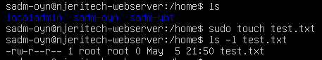
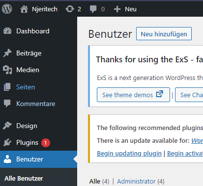
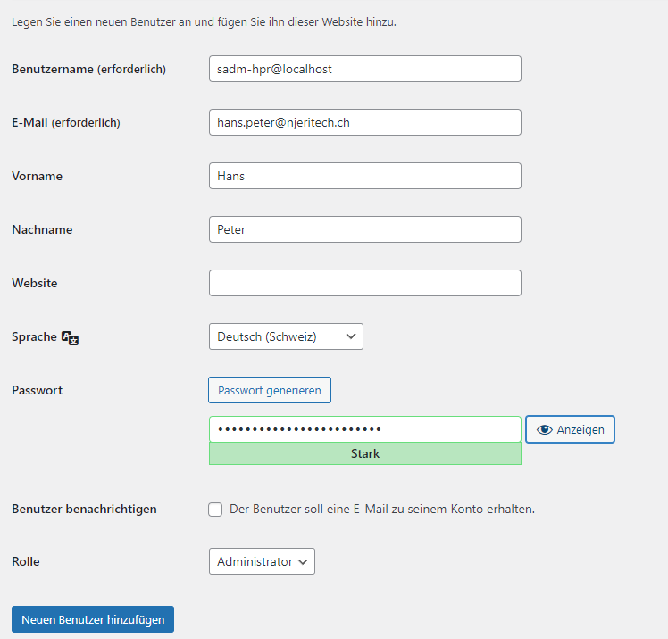
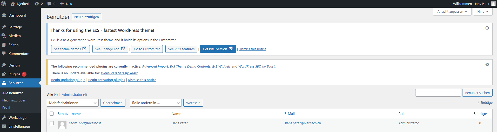

# Benutzerkonzept

## Inhaltsverszeichnis

- [Benutzerkonzept](#benutzerkonzept)
  - [Inhaltsverszeichnis](#inhaltsverszeichnis)
    - [Administratormatrix](#administratormatrix)
    - [Namensgebung Konten](#namensgebung-konten)
    - [Persönliche Administratorenmatrix](#persönliche-administratorenmatrix)
    - [Erstellen root User Web-/ Mailserver](#erstellen-root-user-web--mailserver)
    - [Erstellen Administrator WordPress](#erstellen-administrator-wordpress)


### Administratormatrix 


Diese Administratorkonten werden nur in Notfällen genutzt. Bei normalem Betrieb muss mit den persönlichen Administratorkonten gearbeitet werden, um Anpassungen oder Events nachverfolgen kann. Der Zugriff auf Hostpoint ist beschränkt auf einen Administratoren.

| Dienst | Benutzername | Berechtigungslevel | Location / URL |
| :---- | :--- | :--- | :--- |
| Webserver | localadmin | root | localhost |
| Mailserver | localadmin | root | localhost |
| Hostpoint | oktay_yildiran07@hotmail.com | Administrator | https://admin.hostpoint.ch/customer/Auth/Login |
| WordPress | wordpress@localhost | Administrator | https://njeritech.ch |


### Namensgebung Konten
Der Benutzername besteht immer aus dem ersten Buchstaben des Vor- und Nachnamens und der letzte Buchstabe vom Nachnamen. 

**Beispiel:**
| Name | Vorname | Berechtigungslevel | Benutzername |
| :---- | :--- | :--- | :--- |
| Peter | Hans | System Administrator | sadm-hpr |
| Müller | Thomas | Benutzer | mts |


### Persönliche Administratorenmatrix


Mitarbeiter erhalten immer ein persönliches Administratorenkonto. Somit stärkt man auch das Verantwortungsbewusstsein des Mitarbeitenden und vermeidet Fehler.

| Dienst | Benutzername | Berechtigungslevel | Location / URL |
| :---- | :--- | :--- | :--- |
| Webserver | sadm-oyn <br> sadm-ybt | root | localhost |
| Mailserver | sadm-oyn <br> sadm-ybt | root | localhost |
| WordPress | sadm-oyn@localhost <br> sadm-ybt@localhost | Administrator | https://njeritech.ch |


### Erstellen root User Web-/ Mailserver

Auf dem Terminal folgenden Befehl ausführen: 

```
sudo adduser <Benutzername>

Enter new UNIX password:
Retype new UNIX password:
passwd: password updated succesfully
Changing the user information for <Benutzername>
Enter the new value, or press ENTER for the default
        Full Name []: -
        Room Number []: -
        Work Phone []: -
        Home Phone []: -
        Other []: -
Is the information correct [Y/n]: y <ENTER>
```

Zuletzt die Benutzerberechtigung auf sudo setzen mit folgendem Befehl: <br>
``sudo usermod -aG sudo <Benutzername>``

Wir testen nun ob die Berechtigungen richtig gesetzt wurden mit folgenden Befehlen:

```
szdi tizcg test.txt
ls -l test.txt
```

**Test**

| Testbeschreibung | Tester | Teststatus | Testbeweis |
| :---- | :--- | :--- | :--- |
| Ordner erstellen mit User <br> und Berechtigungen überprüfen | Oktay Yildiran | Berechtigung richtig gesetzt |  |


### Erstellen Administrator WordPress

Nachdem man sich mit dem wordpress@localhost angemeldet hat unter Benutzer > Alle Benutzer den Button Neu hinzufügen drücken. 



Als nächstes den Benutzernamen eingeben und die weiteren Informationen ausfüllen. Unter Rolle Administrator auswählen und unten auf den Button neuen Benutzer hinzufügen drücken. 



**Test**

| Testbeschreibung | Tester | Teststatus | Testbeweis |
| :---- | :--- | :--- | :--- |
| Login mit Administratorkonto | Oktay Yildiran | Funktioniert |  |

