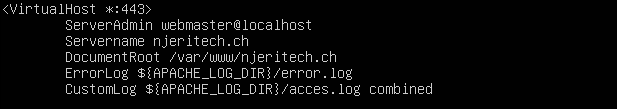
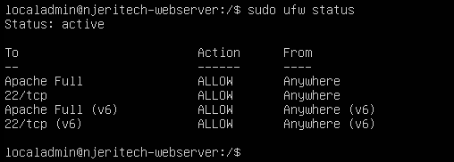
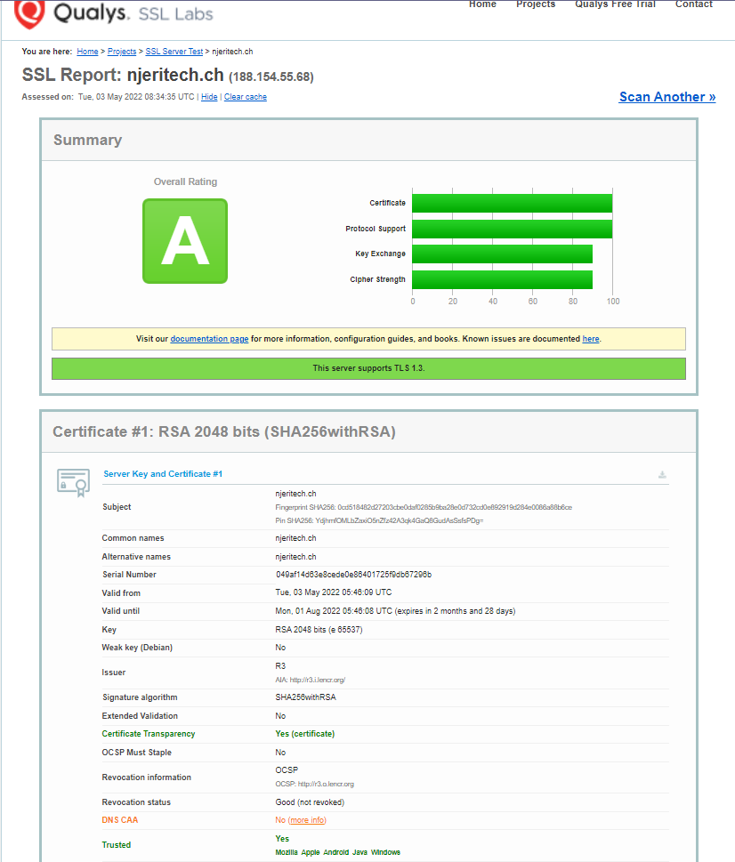

# Zertifikat für Webserver

## Inhaltsverszeichnis
- [Zertifikat für Webserver](#zertifikat-für-webserver)
  - [Inhaltsverszeichnis](#inhaltsverszeichnis)
    - [Domäne njeritech.ch](#domäne-njeritechch)
    - [Apache Konfigurieren](#apache-konfigurieren)
    - [SSL-Zertifikat erstellen mit Certbot](#ssl-zertifikat-erstellen-mit-certbot)
    - [Hostpoint Konfiguration](#hostpoint-konfiguration)
    - [Testing](#testing)
    - [Quellen](#quellen)

### Domäne njeritech.ch

Wir haben uns die Domäne beim Provider ``Hostpoint`` gekauft. Somit hatten wir eine gültige Domäne die wir für unsere Seite nutzen können, damit sich zukünftig Kunden einfacher unsere Seite besuchen können. 


### Apache Konfigurieren

Wir haben uns das Tool Certbot zur Hilfe genommen, um automatisiert ein SSL-Zertifikat zu erhalten welches auch automatisch erneuert wird. 

Zuerst muss man wie folgt zwei Pakete installieren im Terminal:

```
sudo apt install certbot python3-certbot-apache
```

Als nächstes müssen wir in der Apache Virtual Host-Konfiguration eine Änderung vornehmen. Folgendes wurde gemacht:

```
sudo nano /etc/apache2/sites-available/njeritech.ch-le-ssl.conf
```
In dieser Konfigurationsdatei sollte es ca. wie folgt aussehen:



Nun testen wir den Syntax der Konfigurationsdatei und laden den Dienst Apache neu. 

```
sudo apache2ctl configtest

sudo systemctzl reload apache2
```

Als nächstes sollte man auf der Firewall HTTPS zulassen. Dies hatten wir in einem vorherigen Schritt schon gemacht aber hier noch als wiederholugn:

```
sudo ufw allow 'Apache Full'

sudo ufw delete allow 'Apache'
```

Mit dem Befehl ```sudo ufw status``` kann man nun die Einstellungen überprüfen. Es sollte wie folgt aussehen:



### SSL-Zertifikat erstellen mit Certbot

Zuletzt müssen wir noch das Tool Certbot nutzen um ein SSL-Zertifikat zu generieren. 

Folgenden Befehl muss man eingeben, um ein SSL-Zertifikat zu generieren ohne eine E-Mail Adresse hinterlassen zu müssen: 

```
sudo certbot --apache --register-unsafely-without-email
```

Danach kann man auswählen auf welche Adresse das HTTPS-Zertfikat aktiviert werden soll. Wir haben mit ENTER beide Namen aktiviert.

```
Which names would you like to activate HTTPS for?
- - - - - - - - - - - - - - - - - - - - - - - - - - - - - - - - - - - - - - - -
1: njeritech.ch
2: www.njeritech.ch
- - - - - - - - - - - - - - - - - - - - - - - - - - - - - - - - - - - - - - - -
Select the appropriate numbers separated by commas and/or spaces, or leave input
blank to select all options shown (Enter 'c' to cancel):
```

Zum Ende wird man noch gefragt, ob HTTP-Datenverkehr auf HTTPS umgeleitet werden soll. Dies wollen wir und wählen die Option 2. 

```
Please choose whether or not to redirect HTTP traffic to HTTPS, removing HTTP access.
- - - - - - - - - - - - - - - - - - - - - - - - - - - - - - - - - - - - - - - -
1: No redirect - Make no further changes to the webserver configuration.
2: Redirect - Make all requests redirect to secure HTTPS access. Choose this for
new sites, or if you're confident your site works on HTTPS. You can undo this
change by editing your web server's configuration.
- - - - - - - - - - - - - - - - - - - - - - - - - - - - - - - - - - - - - - - -
Select the appropriate number [1-2] then [enter] (press 'c' to cancel): 2
```

### Hostpoint Konfiguration

Im Hostpoint müssen wir einen A-Record hinzufügen, welches auf die Public IP des Webservers verweist. Somit ist der Webserver nun auch von aussen über die Domäne njeritech.ch erreichbar.


### Testing

Wir nutzen die Webseite https://ssllabs.com, um unser SSL-Zertifikat zu testen. Unser Zertifikat hat eine A-Bewertung erhalten und ist somit eine vertrauenswürdiges Zertifikat.



### Quellen

Certbot Let's Encrypt = https://do.co/3y9msP8

SSL Test = https://bit.ly/3KSwvdU

