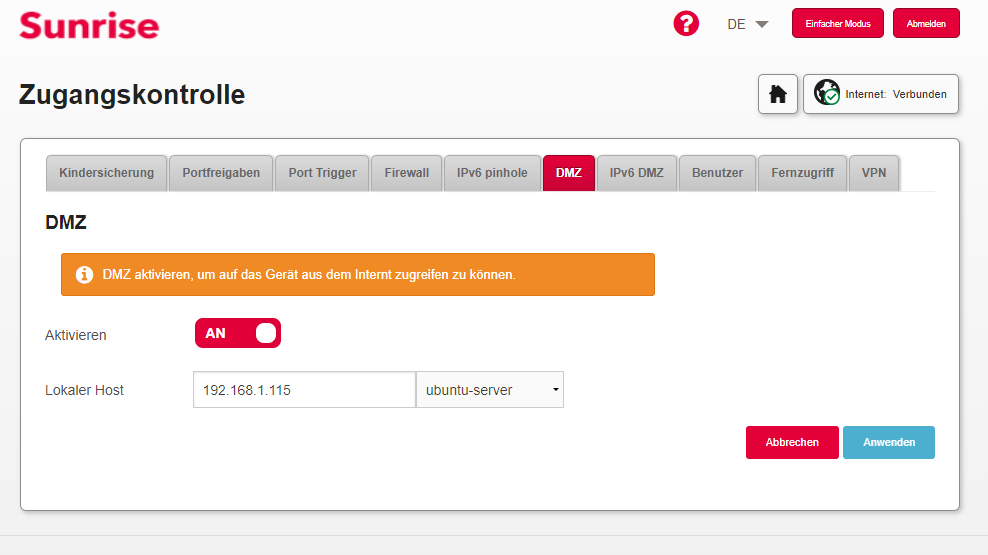

# Webserver

## Inhaltsverszeichnis

- [Anforderungen](#anforderungen)
  - [Inhaltsverszeichnis](#inhaltsverszeichnis)
    - [Webserver aufsetzen](#webserver-aufsetzen)
    - [Webserver Erreichbarkeit konfigurieren](#webserver-erreichbarkeit-konfigurieren)

### Webserver aufsetzen

**Schritt 1: Installieren von Apache**

```
sudo apt-get update

sudo apt-get upgrade

sudo apt install apache2
```

**Schritt 2: Firewall anpassen**

```
sudo ufw app list
```

Zeigt die Anwendungsprofile an. Der Ouput sollte wie folgt aussehen:

```
Output
Available applications:
    Apache
    Apache Full
    Apache Secure
```

Die drei Anwendungsprofile öffnen verschiedene Ports. Wir verwenden das Anwendungsprofil Apache Full, da wir zu Beginn unsere Webseite über HTTP erreichen wollen und dann im weiteren Vorgehen eine HTTPS Weiterleitung erstellen.

**Schritt 3: Test des Webservers**

Um zu überprüfen, ob unser Apache2 Dienst nun läuft benutzen wir folgenden Befehl: 
```
sudo systemctl status apache2
```
Folgender Output sollte folgen:
```
Output
● apache2.service - The Apache HTTP Server
     Loaded: loaded (/lib/systemd/system/apache2.service; enabled; vendor preset: enabled)
     Active: active (running) since Sun 2022-05-01 12:35:30 UTC; 2h 46min ago
       Docs: https://httpd.apache.org/docs/2.4/
   Main PID: 1018 (apache2)
      Tasks: 55 (limit: 1137)
     Memory: 8.0M
     CGroup: /system.slice/apache2.service
             ├─29435 /usr/sbin/apache2 -k start
             ├─29437 /usr/sbin/apache2 -k start
             └─29438 /usr/sbin/apache2 -k start
```

### Webserver Erreichbarkeit konfigurieren


Damit der Webserver nun von aussen erreichbar ist muss man Ihn nach aussen öffnen. Dies haben wir wie folgt auf dem Router eingestellt:

Unter Zugangskontrolle den Reiter DMZ auswählen und die lokale IP-Adresse angeben des Webservers. 



Danach sollte der Webserver von aussen erreichbar sein über die Public IP des Routers. In unserem Fall ist es die IP-Adresse ``188.154.55.68``.

