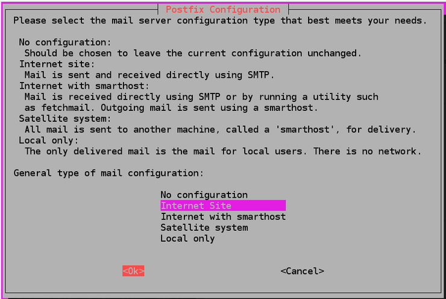

# Mailserver

## Inhaltsverszeichnis

- [Mailserver](#Mailserver)
  - [Inhaltsverszeichnis](#Inhaltsverszeichnis)
  - [Postfix](#Postfix)
    - [Voraussetzungen](#Voraussetzungen)
    - [Installation Postfix](#installation-postifix)
    - [Postfix konfigurieren](#postfix-konfigurieren)
    - [Kontrolle](#kontrolle)

## Postfix

###  Voraussetzungen
- SSH Zugriff auf die TBZ-Cloud
- Gmail-Account mti Google App Password

### Installation Postifix
Als erstes Aktualisiren wir die Pakete und installieren Postifix:

```
sudo apt update
sudo apt install upgrade
sudo apt-get install postfix
```
Nun sollte sich ein GUI öffnen




Hier wählen wir "Internet Site". Im nächsten Schritt geben wir die System mail name angeben. In unserem Fall ist das "m239.domain"


### Postfix konfigurieren
Als nächstes prüfen wir ob das confi-file vorhanden ist. Dies mit dem Befehl:
```
cat /etc/postfix/main.cf
```

Hier nur überprüfen ob alles vorhanden ist, in diesem Schritt nehmen wir noch keine Veränderungen vor.

Mit:
```
ls /etc/postfix/sasl	
```
überprüfen ob das Verzeichniss existiert.

```
sudo vim /etc/postfix/sasl/sasl_passwd
```
in das sasl_passwd file gehen und folgenden Eintrag hinzufügen.
" [smtp.gmail.com]:587 <Eigene-GMail-Adresse>@gmail.com:xxxxxxxxxxxxxxxx"


```
sudo postmap /etc/postfix/sasl/sasl_passwd
```
dannach setzt man die berechtigungen neu:
```
sudo chown root:root /etc/postfix/sasl/sasl_passwd /etc/postfix/sasl/sasl_passwd.db
sudo chmod 0600 /etc/postfix/sasl/sasl_passwd /etc/postfix/sasl/sasl_passwd.db
```
So kann nur root die Dateien auslesen.

Nun müssen wir im Configfile folgende Änderungen vornehmen. Um in das config-file zu kommen folgenden Befehl eingeben:
```
sudo vim /etc/postfix/main.cf
```

relayhost = [smtp.gmail.com]:587

	# Enable SASL authentication
	smtp_sasl_auth_enable = yes
	smtp_sasl_security_options = noanonymous
	smtp_sasl_password_maps = hash:/etc/postfix/sasl/sasl_passwd
	smtp_tls_security_level = encrypt
	smtp_tls_CAfile = /etc/ssl/certs/ca-certificates.crt

Zuletzt muss man den Postfix dienst neustarten. Dies geht mit: 
```
sudo systemctl restart postfix
```

### Kontrolle
Um das ganze zu testen, kann man mit dem Befehl "echo" eine test mail send.

Um echo nutzen zu können muss man zuerst die "mailutils" installieren
```
sudo apt install mailutils
```
Wenn diese installiert kann man den folgenden Befehl senden. Es ist sehrwahrscheinlich, das die Mail im Spam-Ordner landen wird, diesen sollte man also auch überprüfen.

```
echo "Test email body" | mail -s "Subject line" <email_address>
```
