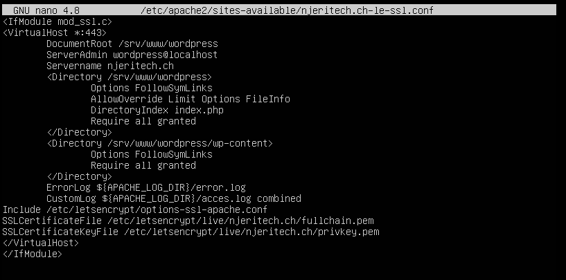
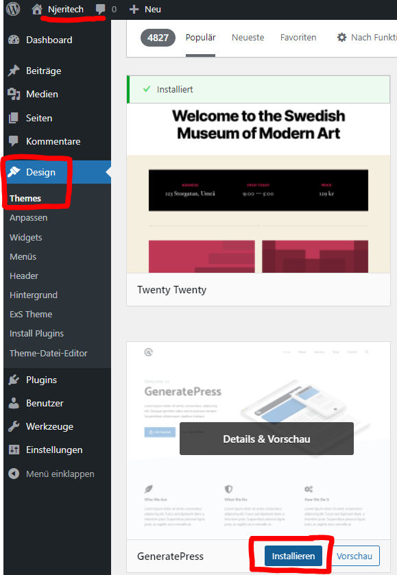
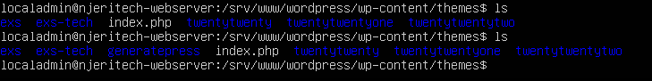

# Anforderungen

## Inhaltsverszeichnis
- [Anforderungen](#anforderungen)
  - [Inhaltsverszeichnis](#inhaltsverszeichnis)
    - [Erste CMS Anbindung mit Shopify](#erste-cms-anbindung-mit-shopify)
    - [Zweite CMS Anbindung mit WordPress](#zweite-cms-anbindung-mit-wordpress)
    - [Testing ob Wordpress Anpassungen auf dem Webserver auch erfolgen:](#testing-ob-wordpress-anpassungen-auf-dem-webserver-auch-erfolgen)
    - [Quellen](#quellen)

### Erste CMS Anbindung mit Shopify
Zuerst hatten wir eine CMS Anbindung mit Shopify gemacht. Aber wie sich herausgestellt hat ist unsere 14-tägige Probezeit zu ende gegangen. Damit man aber weiterhin Shopify nutzen konnte, müsste man eine Pro Version abonnieren. Dies ist nicht Ziel der Sache und somit mussten wir uns nach neuen Lösungsansätzen umsehen.

### Zweite CMS Anbindung mit WordPress

***Installation WordPress und Konfiguration Apache***

Vor der Einrichtung von Wordpress müssen wir auf unserem Webserver gewisse Voraussetzungen erfüllen.

Folgende Tools sollten installiert werden:

```
sudo apt install apache2
                 ghostscript \
                 libapache2-mod-php \
                 mysql-server \
                 php \
                 php-bcmath \
                 php-curl \
                 php-imagick \
                 php-intl \
                 php-json \
                 php-mbstring \
                 php-mysql \
                 php-xml \
                 php-zip
```

Danach müssen wir einen Ordner erstellen worin wir Wordpress installieren können. Dies macht man wie folgt:

```
sudo mkdir -p /srv/www
sudo chown www-data: /srv/www
curl https://wordpress.org/latest.tar.gz | sudo -u www-data tar zx -C /srv/www
```

Da wir beim SSL-Zertifikat schon einige Konfigurationen schon vorgenommen haben und diese beibehalten wollen, passen wir diese nun erneut an.

Die VirtualHost Konfigurationsdatei ist bei uns unter ```/etc/apache2/sites-available/njeritech.ch-le-ssl.conf``` zu finden

Vor der Anpassung für Wordpress sah die Konfigurationsdatei ca. wie folgt aus:

```
<IfModule mod_ssl.c>
<VirtualHost *:443>
        ServerAdmin webmaster@localhost
        ServerName njeritech.ch
        DocumentRoot /var/www/njeritech.ch
        ErrorLog ${APACHE_LOG_DIR}/error.log
        CustomLog ${APACHE_LOG_DIR}/acces.log combined
*...*
*...*
*...*
</VirtualHost>
<IfModule>
```

Diese müssen wir nun wie folgt ergänzen, um Wordpress anzubinden:



Nun müssen wir mit dem Befehl ``sudo a2ensite njeritech.ch-le-ssl.conf`` die Seite aktivieren.

Da wir von unseren ersten Versuchen noch eine Konfig-Datei hatten müssen wir diese mit dem Befehl ``sudo a2dissite njeritech.ch`` deaktivieren.

Zuletzt muss man den Apache Dienst neu laden mit dem Befehl ``sudo service apache2 reload``

***Database konfigurieren:***

```
sudo mysql -u root

Welcome to the MySQL monitor.  Commands end with ; or \g.
Your MySQL connection id is 7
Server version: 5.7.20-0ubuntu0.16.04.1 (Ubuntu)

Copyright (c) 2000, 2017, Oracle and/or its affiliates. All rights reserved.

Oracle is a registered trademark of Oracle Corporation and/or its
affiliates. Other names may be trademarks of their respective
owners.

Type 'help;' or '\h' for help. Type '\c' to clear the current input statement.

mysql> CREATE DATABASE wordpress;
Query OK, 1 row affected

mysql> CREATE USER wordpress@localhost IDENTIFIED BY Admin123;
Query OK, 1 row affected (0,00 sec)

mysql> GRANT SELECT,INSERT,UPDATE,DELETE,CREATE,DROP,ALTER
    -> ON wordpress.*
    -> TO wordpress@localhost;
Query OK, 1 row affected (0,00 sec)

mysql> FLUSH PRIVILEGES;
Query OK, 1 row affected (0,00 sec)

mysql> quit
Bye

sudo service mysql start
```

### Testing ob Wordpress Anpassungen auf dem Webserver auch erfolgen:

Ziel dieses Tests ist es zu überprüfen ob Anpassungen auf WordPress auch lokale Auswirkungen haben

Um dies zu testen werden wir im WordPress Portal ein Design installieren und überprüfen, ob dieser im richtigen Pfad lokal auf dem Webserver abgespeichert wird.

So sieht der Ordner für themes zurzeit aus:

```
localadmin@njeritech-webserver: /srv/www/wordpress/wp-content/themes$ ls
exs ext-tech index.php twentytwenty twentytwentyone twentytwentytwo
```

Nun werden wir auf dem WordPress Portal ein Design auswählen und diese installieren. Wir nehmen beispielsweise das Theme ``GeneratePress``:



Nun sollte auf dem Webserver das Theme GeneratePress installiert sein:



***Test erfolgreich***

Somit funktioniert die CMS Anbindung an unseren Webserver.

### Quellen

WordPress Installationsguide: https://do.co/3kzRGXG

Shopify Installationsguide https://bit.ly/3vPlgPm (nicht mehr verwendet / Lizenz abgelaufen)