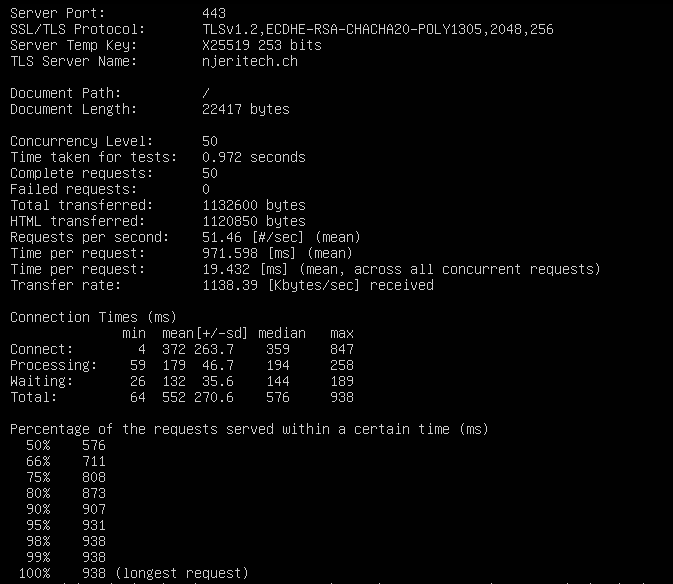
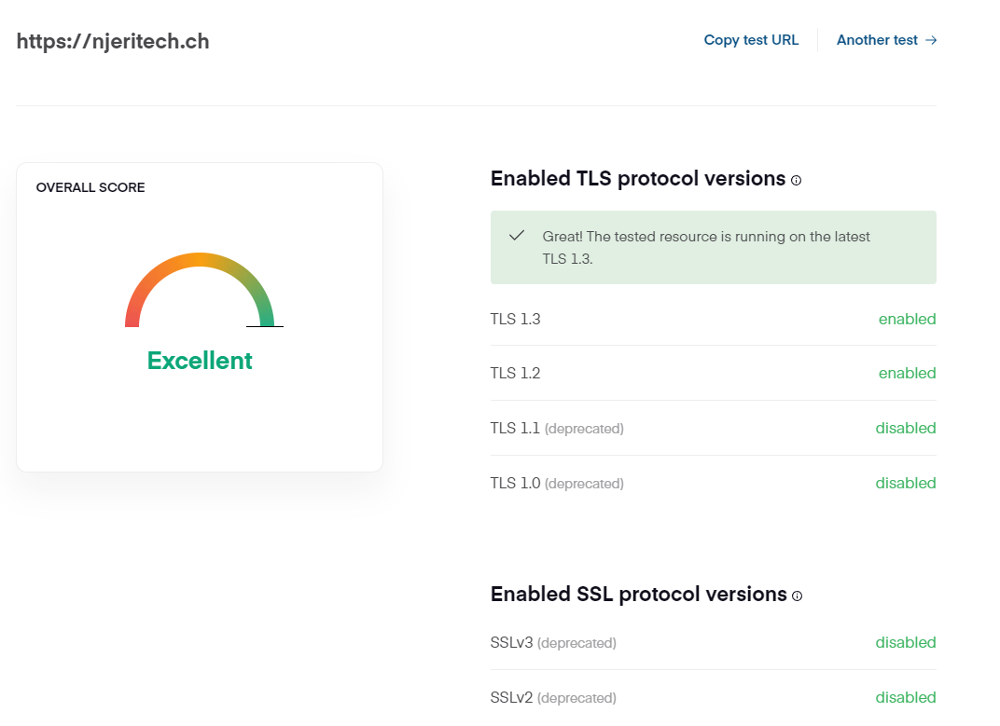
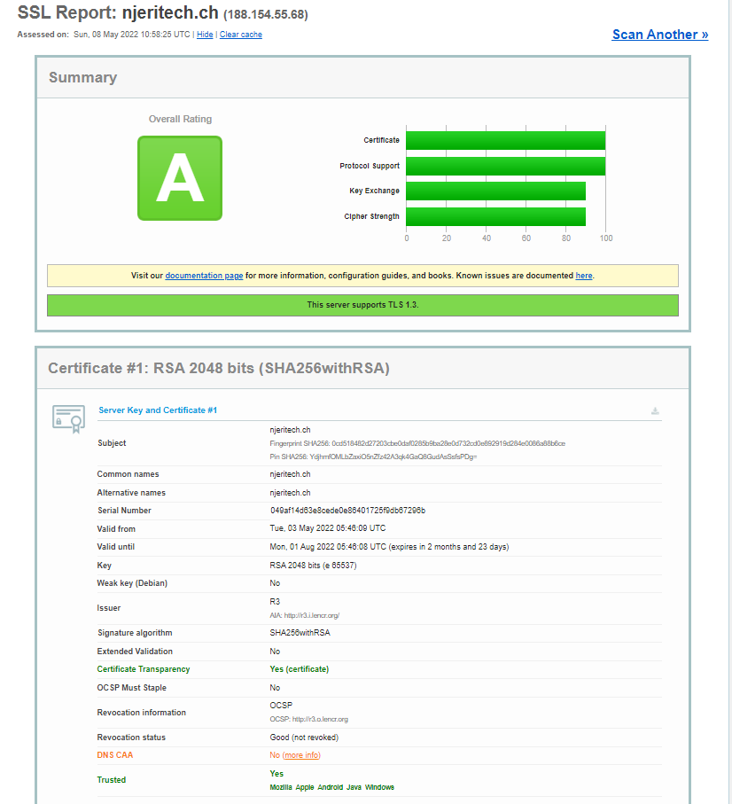
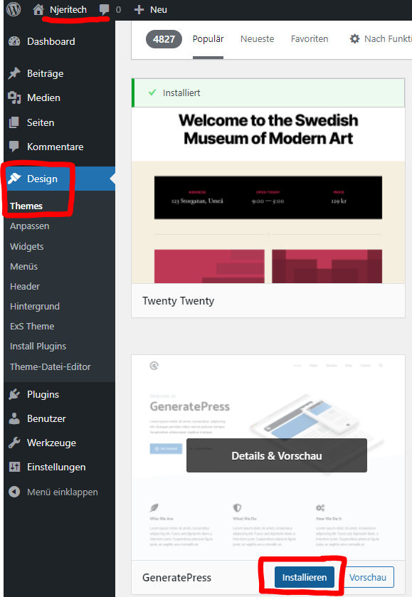
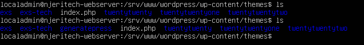
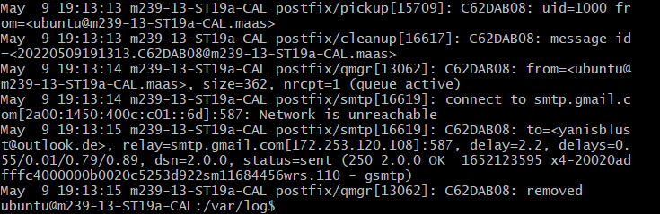
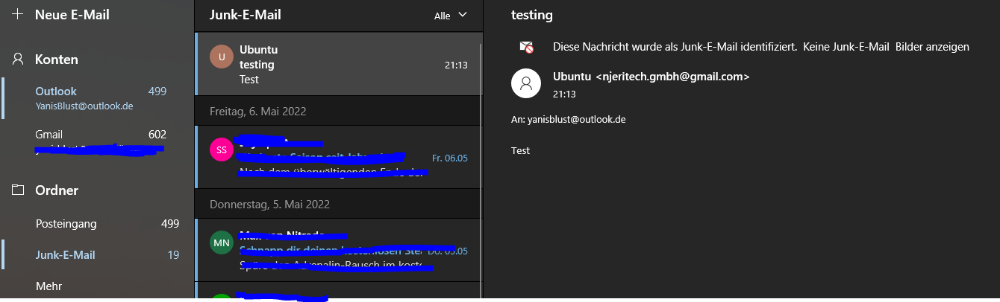

# Testing

## Inhaltsverszeichnis
- [Testing](#testing)
  - [Inhaltsverszeichnis](#inhaltsverszeichnis)
    - [Testing Webserver](#testing-webserver)
      - [Apache Perfomancetest](#apache-perfomancetest)
      - [Security Tests](#security-tests)
    - [Testing WordPress](#testing-wordpress)
    - [Testing-Mailserver](#testing-mailserver)


### Testing Webserver 

#### Apache Perfomancetest
Beim Apache2 Webserver hat man die Möglichkeit die Auslastungskapazitäten mit ApacheBench zu testen. Dies macht man wie folgt:

```
apt-get update

apt-get install -y apache2-utils


ab -c 50 -n 50 https://njeritech.ch/
```
Danach wird die Performance unseres Webservers angezeigt. Wie man sieht hat unser Webserver zwischen 576ms und 938ms Verzögerung. Das Ziel in Zukunft wäre diese Verzögerung niedriger zu halten. 



#### Security Tests

**TLS Test auf  https://cdn77.com/tls-test**



**SSL Test auf https://ssllabs.com/ssltest**




### Testing WordPress
Ziel dieses Tests ist es zu überprüfen ob Anpassungen auf WordPress auch lokale Auswirkungen haben

Um dies zu testen werden wir im WordPress Portal ein Design installieren und überprüfen, ob dieser im richtigen Pfad lokal auf dem Webserver abgespeichert wird.

So sieht der Ordner für themes zurzeit aus:

```
localadmin@njeritech-webserver: /srv/www/wordpress/wp-content/themes$ ls
exs ext-tech index.php twentytwenty twentytwentyone twentytwentytwo
```

Nun werden wir auf dem WordPress Portal ein Design auswählen und diese installieren. Wir nehmen beispielsweise das Theme ``GeneratePress``:



Nun sollte auf dem Webserver das Theme GeneratePress installiert sein:



***Test erfolgreich***

Somit funktioniert die CMS Anbindung an unseren Webserver.

### Testing-Mailserver
| Testbeschreibung | Tester | Teststatus | Testbeweis |
| :---- | :--- | :--- | :--- |
| Mailserver versendet eine E-Mail and den angegebenen Empfänger und diese ist im Postausgang |  Yanis Blust | E-Mail ist im Postausgang | 
| Die versendete E-Mail kommt bei dem angegebenen Empfänger an | Yanis Blust | E-Mail ist im Posteingang | 


